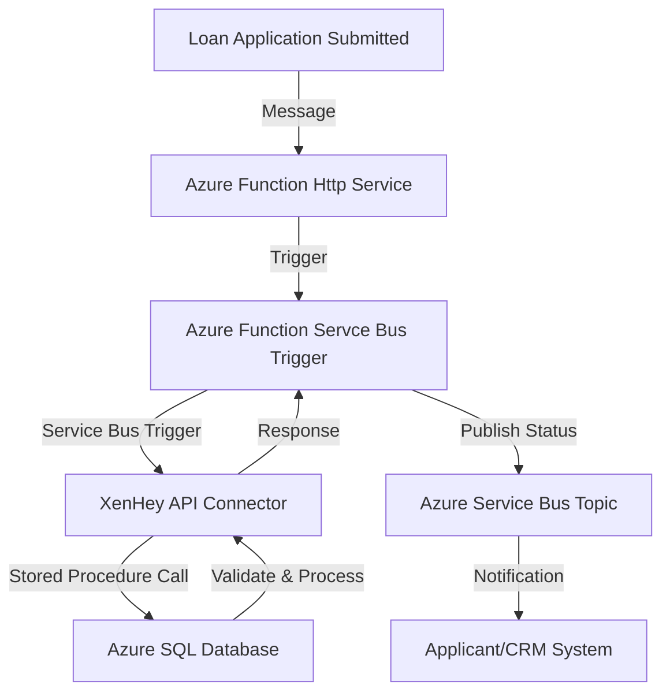

### **Use Case: Automated Loan Processing in Financial Services**

**Overview:**
A financial institution wants to automate the loan application processing pipeline by integrating multiple systems. The goal is to receive loan application requests, process them using Azure Functions,  Azure Service Bus to move and store the results in an Azure SQL database. XenHey's API connector is used to expose Azure SQL stored procedures and views for real-time data retrieval and updates, while Azure Service Bus ensures reliable messaging between systems.

---

### **Use Case Description:**

**Problem Statement:**
- Loan applications arrive from multiple channels (web, mobile, and third-party systems).
- The processing pipeline requires the orchestration of real-time validation, calculations (e.g., credit score assessments), and updates to the Azure SQL database.
- The institution seeks a scalable, secure, and efficient way to automate this process without building extensive custom APIs.

**Solution with XenHey:**
- **Azure Service Bus** handles incoming loan application messages.
- **Azure Functions** processes the messages and calls XenHey’s API connector to interact with Azure SQL.
- **XenHey** exposes Azure SQL stored procedures to validate loan applications, calculate eligibility, and update the application status.

---

### **Workflow Steps:**

1. **Loan Application Submission**:
   - Loan applications are submitted via a web or mobile interface and sent to Azure Service Bus as messages.
   
2. **Message Processing**:
   - Azure Functions listens to the Service Bus queue for incoming loan applications.
   
3. **Database Interaction**:
   - Azure Functions uses XenHey's API connector to:
     - Validate the applicant’s information via a stored procedure.
     - Calculate loan eligibility (e.g., based on credit score, income, and existing loans).
     - Insert or update the loan application status in the Azure SQL database.

4. **Response and Notification**:
   - Once processing is complete, Azure Functions sends a response to a Service Bus topic for downstream systems (e.g., notifying the applicant or updating a CRM system).

---

### **Key Features Utilized:**

1. **XenHey’s API Connector**:
   - Exposes Azure SQL stored procedures for validations, calculations, and updates.
   - Simplifies database interactions with configuration over code.

2. **Azure Service Bus**:
   - Manages reliable message delivery between application submission and processing.

3. **Azure Functions**:
   - Serverless compute processes loan applications and interacts with the database through XenHey.

---

### **Mermaid Diagram:**

---

Set Up Steps 

Creating a serverless API using Azure that leverages Service Bus to communicate with an SQL Database involves several steps. Here's a high-level overview of how you can set this up:

1. **Set Up Azure SQL Database**:
   - Create an Azure SQL Database instance.
   - Set up the necessary tables and schemas you'll need for your application.

2. **Create Azure Service Bus**:
   - Set up an Azure Service Bus namespace.
   - Within the namespace, create a queue or topic (based on your requirement).

3. **Deploy Serverless API using Azure Functions**:
   - Create a new Azure Function App.
   - Develop an HTTP-triggered function that will act as your API endpoint.
   - In this function, when data is received, send a message to the Service Bus queue or topic.

4. **Deploy 2 Service Bus Triggered Function**:
   - Create another Azure Function that is triggered by the Service Bus queue or topic.
   - This function will read the message from the Service Bus and process it. The processing might involve parsing the message and inserting the data into the Azure SQL Database.

5. **Implement Error Handling**:
   - Ensure that you have error handling in place. If there's a failure in processing the message and inserting it into the database, you might want to log the error or move the message to a dead-letter queue.

6. **Secure Your Functions**:
   - Ensure that your HTTP-triggered function (API endpoint) is secured, possibly using Azure Active Directory or function keys.

7. **Optimize & Monitor**:
   - Monitor the performance of your functions using Azure Monitor and Application Insights.
   - Optimize the performance, scalability, and cost by adjusting the function's plan (Consumption Plan, Premium Plan, etc.) and tweaking the configurations.

8. **Deployment**:
   - Deploy your functions to the Azure environment. You can use CI/CD pipelines using tools like Azure DevOps or GitHub Actions for automated deployments.

By following these steps, you'll have a serverless API in Azure that uses Service Bus as a mediator to process data and store it in an SQL Database. This architecture ensures decoupling between data ingestion and processing, adding a layer of resilience and scalability to your solution.

## Appplication Setting 

|Key|Value | Comment|
|:----|:----|:----|
|AzureWebJobsStorage|[CONNECTION STRING]|RECOMMENDATION :  store in AzureKey Vault.|
|ConfigurationPath| [CONFIGURATION FOLDER PATH] |Folder is optional
|ApiKeyName|[API KEY NAME]|Will be passed in the header  :  the file name of the config.
|AppName| [APPLICATION NAME]| This is the name of the Function App, used in log analytics|
|StorageAcctName|[STORAGE ACCOUNT NAME]|Example  "AzureWebJobsStorage"|
|ServiceBusConnectionString|[SERVICE BUS CONNECTION STRING]|Example  "ServiceBusConnectionString".  Recommmended to store in Key vault.|
|DatabaseConnection|[DATABASE CONNECTION STRING]|Example  "DatabaseConnection". Recommmended to store in Key vault.|

> **Note:**  Look at the configuration file in the **Config** Folder and created a Table to record information.

## Configuration Files 

> **Note:** The **Configuration** is located in the  FunctionApp  in a **Config** Folder.

|FileName|Description|
|:----|:----|
|99F77BEF300E4660A63A939ADD0BCF68.json| **Upload File** Parse CSV file --> Write Batched Files To Storage|
|43EFE991E8614CFB9EDECF1B0FDED37C.json| **Service Bus Trigger for SQL DB** | Receive JSON payload and insert into SQL DB|
|43EFE991E8614CFB9EDECF1B0FDED37E.json| **Blob Trigger** Send parsed/sharded file  to Send to Service Bus|
|43EFE991E8614CFB9EDECF1B0FDED37G.json| **Search SQL DB. Return resultset** |

> Create the following blob containers and share in azure storage

|ContainerName|Description|
|:----|:----|
|config|Location for the configuration files|
|processed|These are files the have been parsed and dropped in th processed container|

|Table|Description|
|:----|:----|
|csvbatchfiles|Track the CSV parsed files|

## Service Bus Subscription information

|Subscription Name|Description|
|:----|:----|
|request|Create a Topic|
|sqlmessage|Create a Subscription|

---

### **Benefits of This Solution:**

1. **Scalable Loan Processing**:
   - Azure Functions scales automatically to handle high volumes of applications.
   
2. **Efficient Database Interaction**:
   - XenHey eliminates the need for extensive coding to interact with Azure SQL stored procedures.

3. **Reliable Messaging**:
   - Azure Service Bus ensures that no application is lost, even under heavy loads.

4. **Real-Time Updates**:
   - The use of stored procedures allows for real-time validation and processing.

5. **Security and Compliance**:
   - XenHey ensures secure and compliant database interactions with fine-grained access control.

---

### **Example in Action:**

1. A user submits a loan application via a mobile app.
2. The application data is sent to an Azure Service Bus queue.
3. An Azure Function processes the message, calling a XenHey API to validate the application against Azure SQL.
4. The function updates the application status (e.g., "Pending Approval") in the database using another stored procedure exposed via XenHey.
5. The updated status is published to a Service Bus topic, triggering notifications to the applicant and CRM system.

---

**Conclusion:**
By integrating **XenHey API Connector** with **Azure Functions**, **Azure Service Bus**, and **Azure SQL**, financial institutions can build a robust, scalable, and secure loan processing system. This solution reduces development time, enhances operational efficiency, and ensures compliance with industry standards.
